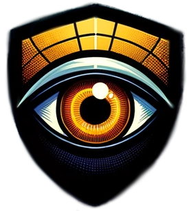

## Introduction

Welcome to Argus project! Argus is a runtime security tool capable of not only monitoring, but also enforcing application behavior.

## Why Argus is special ?

1. Made by a **team of experts**, including **former Tracee and Falco core engineers**.
2. Differently than other similar projects, Argus can deal with **any type of workload**.
3. No events, **no losses**. No events, **no delays**.
4. No performance impact, tiny memory footprint.
5. Easy to use.

## How do I try it ?
[https://dashboard.listen.dev/](https://dashboard.listen.dev/)

> Argus is the tool in charge of [https://www.listen.dev/](https://www.listen.dev/) dynamic runtime analysis feature.

## How do I report bugs ?

[https://github.com/listendev/argus-releases/issues](https://github.com/listendev/argus-releases/issues)

## Mythology

In Greek mythology, Argus Panoptes, or simply Argus, is a fascinating and unique character renowned for his hundred eyes. According to myth, Argus was a giant, an all-seeing guardian, making him an ideal watchman. His most famous tale involves being appointed by Hera, the queen of the gods, to guard the white heifer Io, who was actually Zeus' lover transformed into a cow to escape Hera's wrath. Argus' ability to have some of his eyes sleep while others remained awake made him a nearly impenetrable guardian. Argus' story intertwines themes of vigilance, loyalty, and the intricate dynamics of the divine in Greek mythology.
